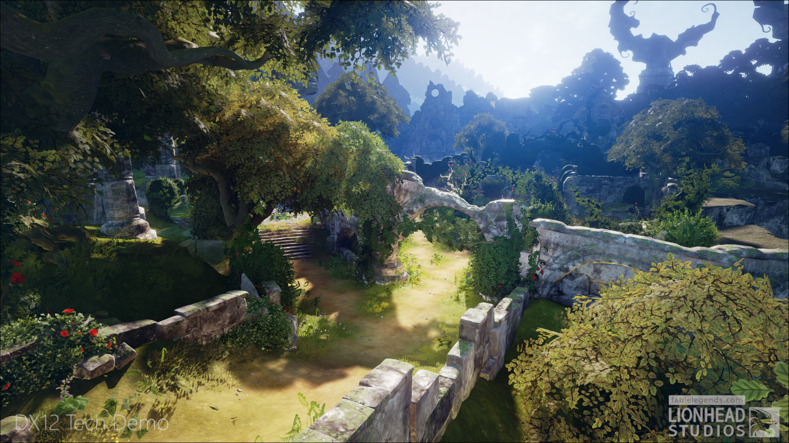
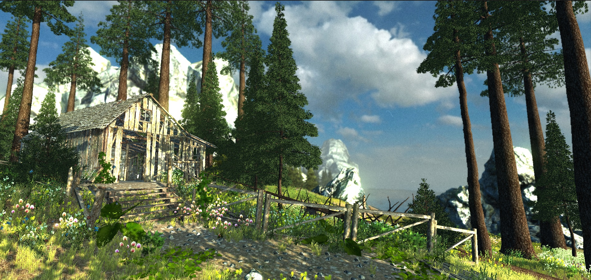
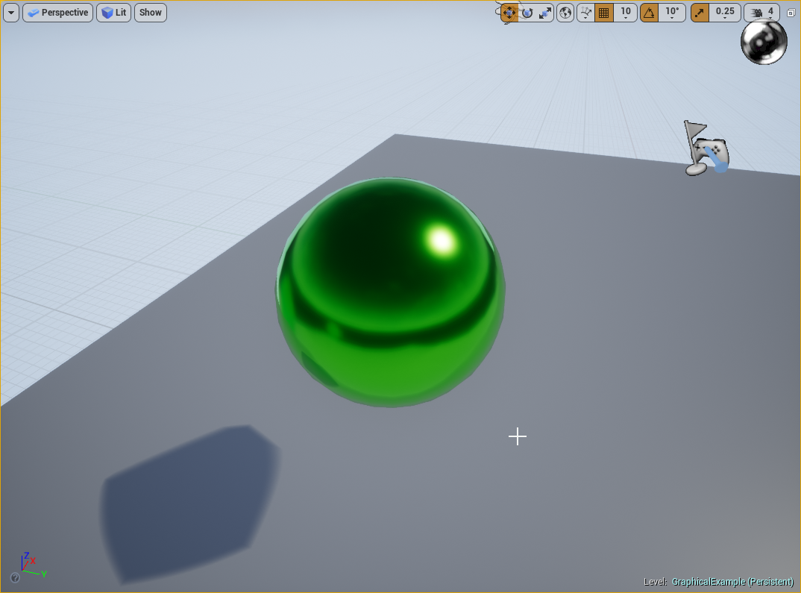
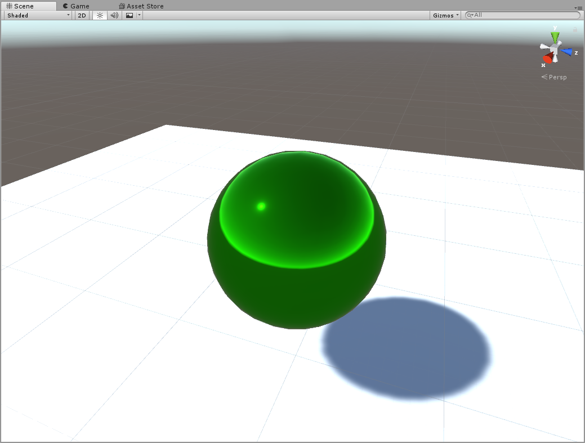
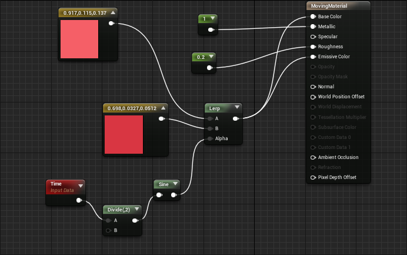
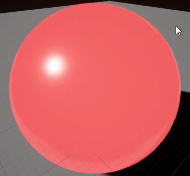

## Graphics

In any game engine to graphics are arguably the most important feature, this is what the users will see.
People can't play your game when they aren't shown something, simple enough.

Both engines feature very advanced graphical capabilities, this is seen the examples below.

Unreal Engine | Unity Engine
------------- | --------------
 | 

I'm not (yet) able to produce graphics like this, so will focus on more basic examples.

### Materials

Both engines use so called 'materials' to apply a look to objects. 
The engines share material variables, such as a base color, metallic parameter and roughness variable.
Materials also can contain textures, which can be used for looks, normal maps and other effects.

Unreal Engine | Unity Engine
------------- | --------------
 | 

Materials have the about the same parameters in both engines. 
The most significant difference is in the programming of materials.
Unreal Engine supports a node based system for defining how a material should be structured, similar to how it works in 3DS Max.
Unity's materials can have parameters that can then be modified by C# (or Javascript) code.
Personally I find Unreal's system better, because it is more easy to seperate the materials.

The material code | Result
----------------- | ---------------------
 | 